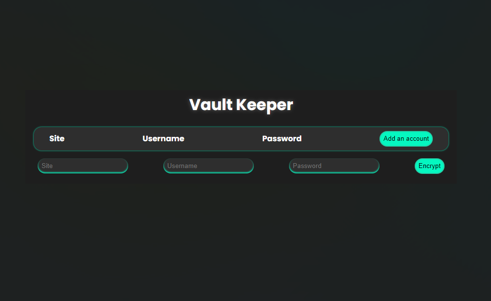

# Vault Keeper: A password manager



## Table of Contents

- [Demo](#demo)
- [Installation](#installation)
- [Usage](#usage)
- [Features](#features)
- [Folder Structure](#folder-structure)
- [Technologies Used](#technologies-used)
- [Authors](#authors)


## [Demo](https://rd2p.github.io/vaultkeeper/)

## Installation

To install Vault Keeper on your local machine:

1. Clone the repository:

   ```shell
   git clone https://github.com/RD2P/vaultkeeper.git
   ```
2. Navigate to the directory
    ```shell
    cd vaultkeeper
    ```
3. Install dependencies
    ```shell
    npm install
    ```
4. Start the application
    ```shell
    npm start
    ```

## Usage

To use the app:

1. Click **Set master key** to toggle the master key input box.
    * Your master key will be used to encrypt and decrypt your account passwords. Do not forget this key!

2. Type your master key in the *key* input box and press **enter**.
    * You will be notified when the mastey key is set with an alert. Click **OK** on the alert to close it.

3. You are now ready to add accounts! Click **Add an account** to toggle the account input row.

4. Enter an account site, username, and password. Click **Encrypt** to encrypt the password.

    **NOTE**: There is **no** persistent storage set up for this project. So for now, all information entered will be deleted when the window is closed. Given that this is only for demo purposes, it would also make sense that you do **not** enter real account information and passwords 😛

5. After encrypting a few passwords, try decrypting some of them using the **Decrypt** button. 

6. Upon clicking the **Decrypt** button, a prompt will ask you for the master key. Enter your master key in the prompt and click **OK**. If you entered the correct key, your password will be decrypted properly. See what happens when a wrong key is entered 😉

## Features

- Set your own master key
- Add as many accounts as you want
- Encrypt and decrypt passwords individually
- Passwords are only properly decrypted with the correct master key

<br>Future:
- Delete accounts
- Change decryption key for existing passwords upong changing master key
- Improved cipher algorithm
- Custom modal for master key prompt (with input type password)
- Persistent storage

## Folder Structure

    vaultkeeper/
      ├── src/               
      |    ├── components/  # Components and logic
      |    ├── styles/      # CSS
      |    ├── App.jsx

## Technologies Used

- React

## Authors

- Raphael

I'm still actively adding features to this project. My aim is to add a backend and database, and eventually package it as an offline desktop app that people can use.

Feel free to report issues and provide feedback!
